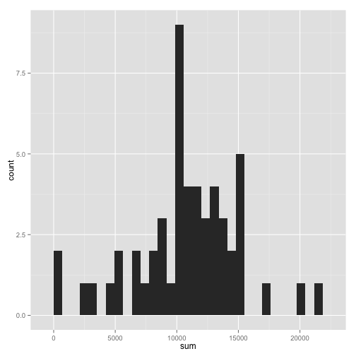
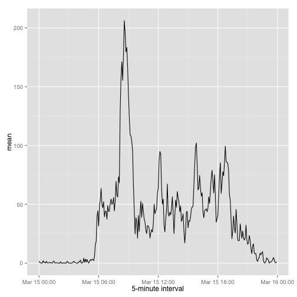
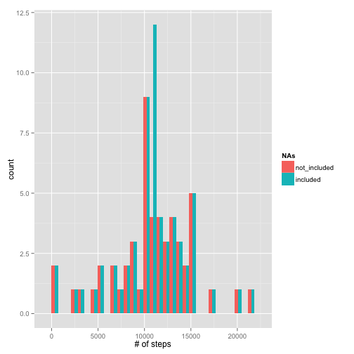
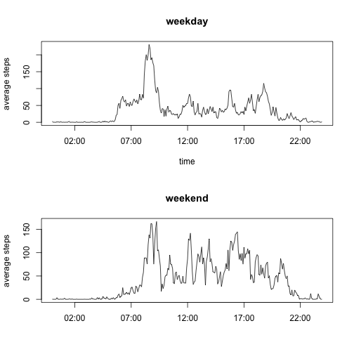

## Loading and preprocessing the data
read data:


```r
dat <- read.csv('./data/activity.csv')
```

remove missing values (NA) from data 


```r
bad <- is.na(dat$steps)

sum_bad <- sum(bad)

xdat <- dat[!bad,]
```
There are 2304 missing values. These will be ignored for the following analysis.

## What is mean total number of steps taken per day?

Group data by-day with dplyr package

```r
library(dplyr)
xdat_day <- group_by(xdat, date)
```

Sum steps for each day

```r
xdat_day_sum <- summarize(xdat_day, sum = sum(steps), mean = mean(steps), median = median(steps))
```

Plot histogram of steps per day with ggplot

```r
library(ggplot2)
qplot(sum, data = xdat_day_sum, geom = "bar")
```

```
## stat_bin: binwidth defaulted to range/30. Use 'binwidth = x' to adjust this.
```

 

Table summary of mean/median number of steps


```r
library(xtable)
xt <- xtable(summary(xdat_day_sum))
print(xt, type = 'html')
```

<!-- html table generated in R 3.1.1 by xtable 1.7-4 package -->
<!-- Sun Mar 15 01:39:26 2015 -->
<table border=1>
<tr> <th>  </th> <th>         date </th> <th>      sum </th> <th>      mean </th> <th>     median </th>  </tr>
  <tr> <td align="right"> 1 </td> <td> 2012-10-02: 1   </td> <td> Min.   :   41   </td> <td> Min.   : 0.1424   </td> <td> Min.   :0   </td> </tr>
  <tr> <td align="right"> 2 </td> <td> 2012-10-03: 1   </td> <td> 1st Qu.: 8841   </td> <td> 1st Qu.:30.6979   </td> <td> 1st Qu.:0   </td> </tr>
  <tr> <td align="right"> 3 </td> <td> 2012-10-04: 1   </td> <td> Median :10765   </td> <td> Median :37.3785   </td> <td> Median :0   </td> </tr>
  <tr> <td align="right"> 4 </td> <td> 2012-10-05: 1   </td> <td> Mean   :10766   </td> <td> Mean   :37.3826   </td> <td> Mean   :0   </td> </tr>
  <tr> <td align="right"> 5 </td> <td> 2012-10-06: 1   </td> <td> 3rd Qu.:13294   </td> <td> 3rd Qu.:46.1597   </td> <td> 3rd Qu.:0   </td> </tr>
  <tr> <td align="right"> 6 </td> <td> 2012-10-07: 1   </td> <td> Max.   :21194   </td> <td> Max.   :73.5903   </td> <td> Max.   :0   </td> </tr>
  <tr> <td align="right"> 7 </td> <td> (Other)   :47   </td> <td>  </td> <td>  </td> <td>  </td> </tr>
   </table>

## What is the average daily activity pattern?

First group data by-interval


```r
xdat_interval <- group_by(xdat, interval)
```

Calculate average steps of daily intervals


```r
xdat_interval_mean <- summarize(xdat_interval, mean = mean(steps))
```

Convert intervals to continuous time. [Reference] (https://class.coursera.org/repdata-012/forum/thread?thread_id=36)


```r
interval <- xdat_interval_mean$interval
intToHHMM <- function (i) {  sprintf("%02d:%02d", i %/% 100, i %% 100)}
p <- intToHHMM(interval)
q <- strptime(p, format = "%H:%M")
```

Add converted time to data


```r
xdat_interval_mean <- cbind(xdat_interval_mean, q)
```

Plot:


```r
qplot(q, mean, data = xdat_interval_mean, geom = "line" , xlab = "5-minute interval")
```

 

Peak time of maximum number of steps is 8:35AM

## Imputing missing values

There are 2304 missing values. 

The average daily steps of 5-min intervals will be added for this analysis.

Obtain rows of data with NA


```r
baddat <- dat[bad,]
```

Vectorize average daily steps by 5-min interval


```r
avedat <- xdat_interval_mean$mean
```

Assign "NA" with average daily steps


```r
baddat$steps <- avedat
```

Combine previous "cleaned" data with assigned data to NAs


```r
alldat <- rbind(xdat, baddat)
```

Sort by date


```r
new_dat <- arrange(alldat, date)
```

Group data by-day


```r
new_dat_day <- group_by(new_dat, date)
```

Sum steps for each day


```r
new_dat_day_sum <- summarize(new_dat_day, sum = sum(steps), 
                             mean = mean(steps), median = median(steps))
```

Generate new data-frame w/ and w/out NAs


```r
df <- rbind(data.frame(NAs = "not_included" , obs = xdat_day_sum$sum), 
            data.frame(NAs = "included" , obs = new_dat_day_sum$sum))
```

Histogram of combined data:


```r
qplot(obs, data = df, 
      geom = "bar", position = "dodge", fill = NAs, xlab = "# of steps")
```

```
## stat_bin: binwidth defaulted to range/30. Use 'binwidth = x' to adjust this.
```

 

Table summary of mean/median/sum for entire data and data w/o NA below


```r
library(xtable)
xt2 <- xtable(summary(new_dat_day_sum))
print(xt2, type = 'html')
```

<!-- html table generated in R 3.1.1 by xtable 1.7-4 package -->
<!-- Sun Mar 15 01:39:27 2015 -->
<table border=1>
<tr> <th>  </th> <th>         date </th> <th>      sum </th> <th>      mean </th> <th>     median </th>  </tr>
  <tr> <td align="right"> 1 </td> <td> 2012-10-01: 1   </td> <td> Min.   :   41   </td> <td> Min.   : 0.1424   </td> <td> Min.   : 0.000   </td> </tr>
  <tr> <td align="right"> 2 </td> <td> 2012-10-02: 1   </td> <td> 1st Qu.: 9819   </td> <td> 1st Qu.:34.0938   </td> <td> 1st Qu.: 0.000   </td> </tr>
  <tr> <td align="right"> 3 </td> <td> 2012-10-03: 1   </td> <td> Median :10766   </td> <td> Median :37.3826   </td> <td> Median : 0.000   </td> </tr>
  <tr> <td align="right"> 4 </td> <td> 2012-10-04: 1   </td> <td> Mean   :10766   </td> <td> Mean   :37.3826   </td> <td> Mean   : 4.474   </td> </tr>
  <tr> <td align="right"> 5 </td> <td> 2012-10-05: 1   </td> <td> 3rd Qu.:12811   </td> <td> 3rd Qu.:44.4826   </td> <td> 3rd Qu.: 0.000   </td> </tr>
  <tr> <td align="right"> 6 </td> <td> 2012-10-06: 1   </td> <td> Max.   :21194   </td> <td> Max.   :73.5903   </td> <td> Max.   :34.113   </td> </tr>
  <tr> <td align="right"> 7 </td> <td> (Other)   :55   </td> <td>  </td> <td>  </td> <td>  </td> </tr>
   </table>

```r
print (xt, type = 'html')
```

<!-- html table generated in R 3.1.1 by xtable 1.7-4 package -->
<!-- Sun Mar 15 01:39:27 2015 -->
<table border=1>
<tr> <th>  </th> <th>         date </th> <th>      sum </th> <th>      mean </th> <th>     median </th>  </tr>
  <tr> <td align="right"> 1 </td> <td> 2012-10-02: 1   </td> <td> Min.   :   41   </td> <td> Min.   : 0.1424   </td> <td> Min.   :0   </td> </tr>
  <tr> <td align="right"> 2 </td> <td> 2012-10-03: 1   </td> <td> 1st Qu.: 8841   </td> <td> 1st Qu.:30.6979   </td> <td> 1st Qu.:0   </td> </tr>
  <tr> <td align="right"> 3 </td> <td> 2012-10-04: 1   </td> <td> Median :10765   </td> <td> Median :37.3785   </td> <td> Median :0   </td> </tr>
  <tr> <td align="right"> 4 </td> <td> 2012-10-05: 1   </td> <td> Mean   :10766   </td> <td> Mean   :37.3826   </td> <td> Mean   :0   </td> </tr>
  <tr> <td align="right"> 5 </td> <td> 2012-10-06: 1   </td> <td> 3rd Qu.:13294   </td> <td> 3rd Qu.:46.1597   </td> <td> 3rd Qu.:0   </td> </tr>
  <tr> <td align="right"> 6 </td> <td> 2012-10-07: 1   </td> <td> Max.   :21194   </td> <td> Max.   :73.5903   </td> <td> Max.   :0   </td> </tr>
  <tr> <td align="right"> 7 </td> <td> (Other)   :47   </td> <td>  </td> <td>  </td> <td>  </td> </tr>
   </table>

The means don't change based on this analysis... 

## Are there differences in activity patterns between weekdays and weekends?

convert dates to weekdays


```r
dates <- new_dat$date
dates_POS <- as.POSIXlt(dates)
dates_POS_day <- weekdays(dates_POS)
```

Vectorize days into 'weekday' or 'weekend'


```r
intoDay <- function (a) {
        day <- c()
        for (i in a){
                {if (i == "Saturday" | i == "Sunday") {
                        day <- c(day, "weekend")}

                else {
                        day <- c(day, "weekday")}
                }
        }
        return(day)
}

day <- intoDay(dates_POS_day)
```

Bind day category vector to data (with NAs included)


```r
new_dat <- cbind(new_dat, day)
```

Group by-day and by-interval


```r
new_dat_interval_day <- group_by(new_dat, interval, day)
```

Obtain averages of steps for weekend and weekdays


```r
new_dat_interval_day_sum <- summarize(new_dat_interval_day, mean_steps = mean(steps))
```

Separate weekday and weekend data


```r
new_dat_interval_day_sum_weekday <- filter(new_dat_interval_day_sum, day == "weekday")
new_dat_interval_day_sum_weekend <- filter(new_dat_interval_day_sum, day == "weekend")
```

Add contiuous time 


```r
new_dat_interval_day_sum_weekday_q <- cbind(new_dat_interval_day_sum_weekday, q)
new_dat_interval_day_sum_weekend_q <- cbind(new_dat_interval_day_sum_weekend, q)
```

Make one data frame from weekend & weekday mean steps


```r
df <- cbind(data.frame(interval = new_dat_interval_day_sum_weekday_q$q, weekday_steps = new_dat_interval_day_sum_weekday_q$mean_steps, weekend_steps = new_dat_interval_day_sum_weekend_q$mean_steps))
```

plot weekday and weekend pannels:


```r
par(mfcol = c(2,1))
with(df,{
        plot(df$interval, df$weekday_steps, type = 'l', xlab = "time" , ylab = "average steps" , main = "weekday")	
	plot(df$interval, df$weekend_steps, type = 'l', xlab = "" , ylab = "average steps" , main = "weekend")
})
```

 


